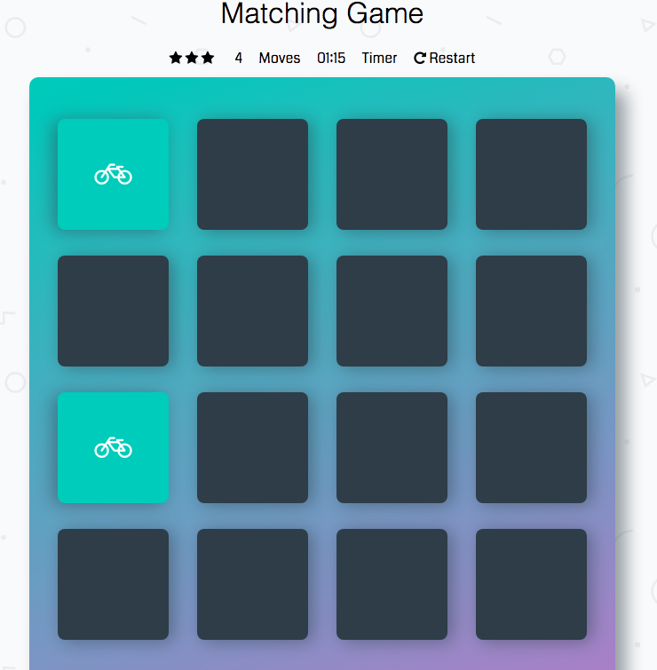
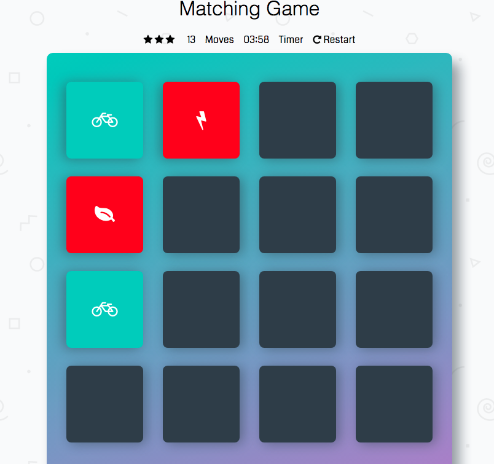
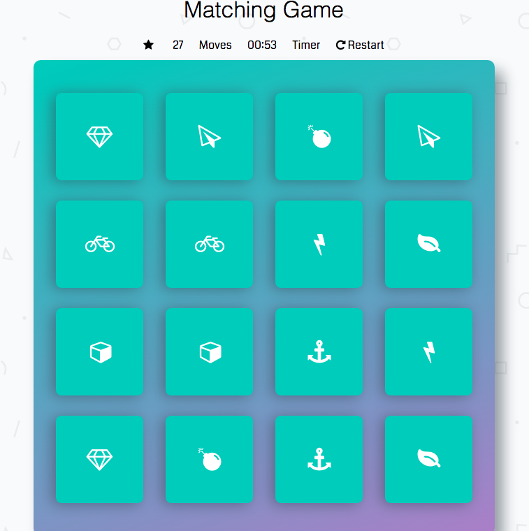
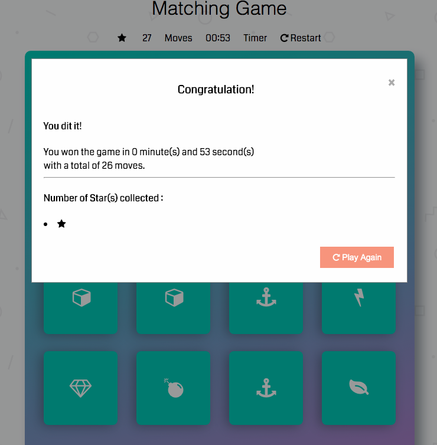

# Memory Game Project

The memory game or card matching game is an Udacity project also know as 'concentration'. Using `HTML`, `CSS` and `JavaScript` enable an interactive experience while having fun !

You can access the memory game from [this link](https://damiensco.github.io/memory-game/index.html).

## Table of Contents

* [How to Run the Application](#how-to-run-the-application)
* [Game Rules](#game-rules)
* [Technical](#technical)
* [Credits](#credits)

## How to Run the Application

1.You can download or clone this repository.

2.Find the `index.html` file, and open the file in a modern browser.

## Game Rules

The game board consists of sixteen "cards" arranged in a grid. The deck is made up of eight different pairs of cards, each with different symbols on one side. The cards are arranged randomly on the grid with the symbol face down. The gameplay rules are very simple: flip over two hidden cards at a time to locate the ones that match!

Each turn:

* The player flips one card over to reveal its underlying symbol.
* The player then turns over a second card, trying to find the corresponding card with the same symbol.
* If the cards match, both cards stay flipped over.
* If the cards do not match, both cards are flipped face down.
* The game ends once all cards have been correctly matched.

1.Correct match

2.Uncorrect match

3.Completed board

4.Game over modal

## Technical

This project consists of the following assets:

* **index.html**  - contains the game's html structure.
* **app.css** - contains the game's board styling.
* **app.js** - contains all the board actions & logic.

## Credits

* For shuffling the cards **shuffle** javaScript function was used from http://stackoverflow.com/a/2450976
* For starting and stopping the timer from Udacity Student Leader Ryan Waite
* For the card and rating the user from Udacity Student Leader Yahya Elharony
* For the congratulations Popup message, it was used from https://www.w3schools.com/howto/howto_css_modals.asp
